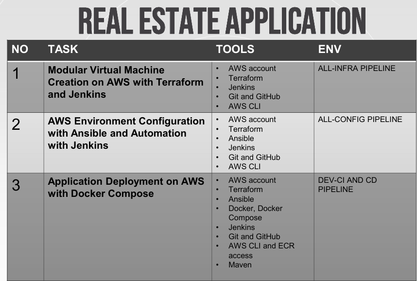
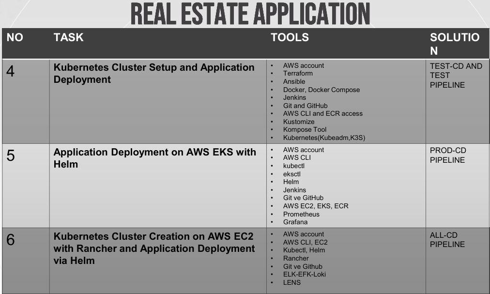
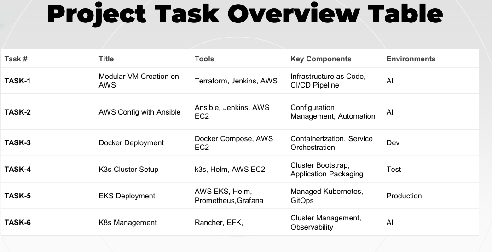

# Project – Real Estate Cloud DevOps

This project demonstrates the design and implementation of an **end-to-end DevOps pipeline** for a real estate application on AWS.  
It covers infrastructure provisioning, configuration management, application deployment, container orchestration, and cloud-native monitoring using modern DevOps tools.

---

## Project Modules

### ✅ Module 1: Modular Virtual Machine Creation on AWS  
Provisioned EC2 instances using **Terraform** and automated provisioning with **Jenkins** pipelines.

### ✅ Module 2: Infrastructure Configuration with Ansible  
Configured and managed EC2 instances using **Ansible**, fully automated through **Jenkins**. Built upon Module 1.

### ✅ Module 3: Application Deployment with Docker Compose  
Built Docker images and pushed them to **AWS ECR**, deployed the application on EC2 using **Docker Compose**, and automated the workflow with **Jenkins**.

### ✅ Module 4: Migration to Kubernetes  
Containerized the application with **Kompose**, deployed it on **K3s**, managed with **kubectl**, and integrated automation via **Jenkins**.

### ✅ Module 5: Deployment on AWS EKS with Helm  
Deployed the application on **AWS EKS** using **Helm**, configured **Nginx Ingress**, and set up monitoring with **Prometheus & Grafana**. Fully automated via **Jenkins** pipelines.

### ✅ Module 6: Kubernetes Management with Rancher and EFK Stack  
Created and managed a Kubernetes cluster with **Rancher**, deployed the application using GitOps-based **Helm charts**, visualized the cluster with **Kubernetes Lens**, and implemented centralized logging with the **EFK stack** (Elasticsearch, Fluentd, Kibana).

---

## Tools & Technologies  
**Infrastructure:** Terraform, Ansible, AWS (EC2, VPC, IAM, EKS, ECR)  
**CI/CD & Automation:** Jenkins, Git, GitHub  
**Containerization & Orchestration:** Docker, Docker Compose, Kubernetes, Helm, Kompose, Kustomize, Rancher  
**Monitoring & Logging:** Prometheus, Grafana, EFK (Elasticsearch, Fluentd, Kibana), Lens  

---

## Outcome  
By leveraging modern DevOps practices, Kubernetes, and AWS cloud infrastructure, this project delivers a **real-world enterprise CI/CD pipeline**.  
It demonstrates expertise across the full DevOps lifecycle — from **infrastructure as code** and **configuration management**, to **containerized deployments**, **Kubernetes orchestration**, and **cloud-native monitoring**.

## ⚠️ Production Notes

This project demonstrates a **step-by-step migration path** from simple EC2 provisioning to advanced Kubernetes-based deployments on AWS.  
Each module provides production-oriented workflows (Terraform, Ansible, Docker, Kubernetes, Helm, Rancher) that reflect real DevOps practices.  

In a full enterprise-grade environment, the following additional components would typically be included to ensure security, scalability, and high availability:

- Custom **VPC, subnets, NAT gateways, and route tables**  
- Managed **database services** (Amazon RDS, Aurora, DynamoDB)  
- **Load Balancers** and **Auto Scaling Groups** for elasticity and high availability  
- Strict **IAM policies** following the least privilege principle  
- Multi-AZ / Multi-Region **disaster recovery strategies**  
- Centralized **monitoring, logging, and alerting**  
- **Secrets management** solutions (AWS Secrets Manager, Vault)  

By addressing these aspects, the architecture can be scaled and hardened into a fully **production-ready system**.

---

## 📊 Project Overview Table

